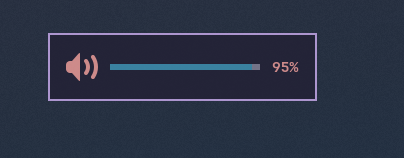
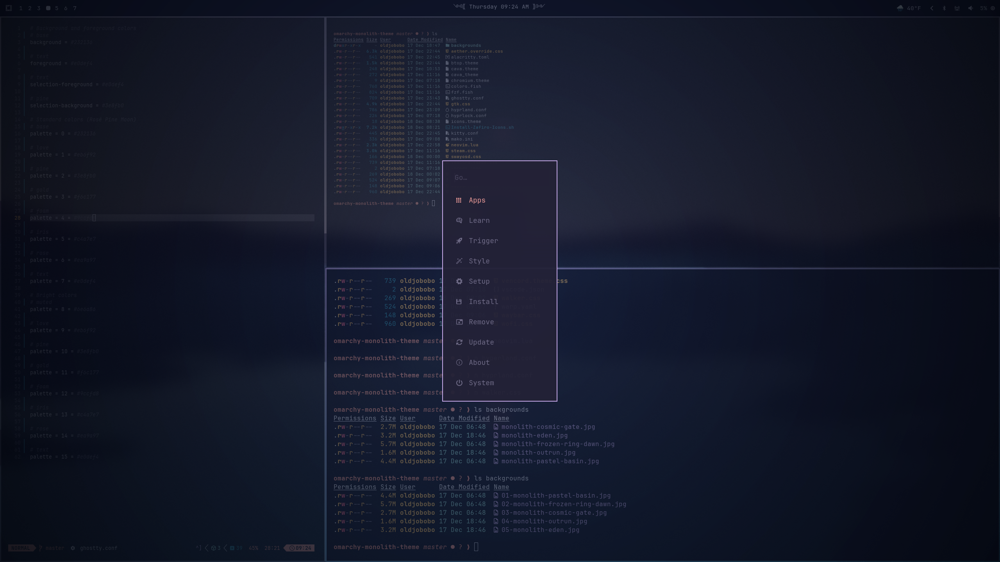
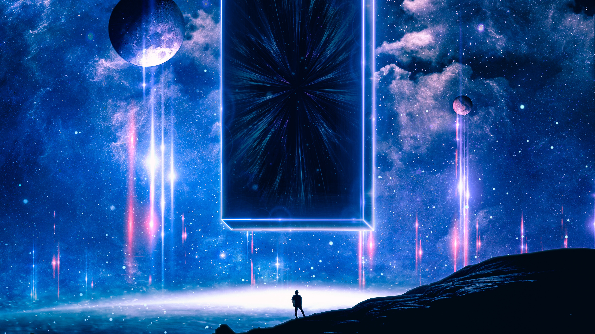
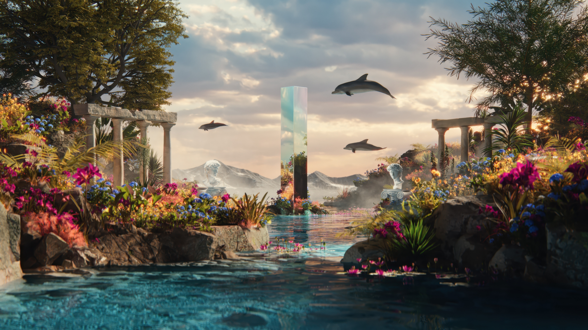

# Omarchy Monolith Theme
A compact, gapless desktop look tuned for laptops and small screens while still feeling polished and atmospheric.

## Preview


**Widgets**
-  `404x158` — on-screen volume overlay  
-  `2560x1440` — menu/search overlay

## Wallpapers
| Pastel Basin | Frozen Ring Dawn |
| --- | --- |
|  |  |

| Cosmic Gate | Outrun | Eden |
| --- | --- | --- |
|  |  |  |

## Install
```bash
omarchy-theme-install https://github.com/OldJobobo/omarchy-monolith-theme
```

### Requirements
- Zafiro-Icons-Dark (install from the AUR or from the project’s GitHub release/source: [github.com/zayronxio/Zafiro-icons](https://github.com/zayronxio/Zafiro-icons))

## Notes
- Built for minimal padding and no wasted space, especially on smaller displays.
- Pair with the included wallpapers and overlays for a cohesive look.
